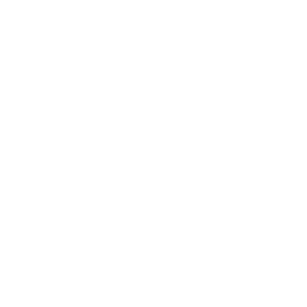

# Hello! Hallo!

---

<!--

)

-->

---

<a href="mailto:evgeniy.shulimenko@gmail.com">
<a href="https://t.me/evgeniy_shulimenko" rel="nofollow">

--- 

###  About Me and my skills:

- I`m Java back-end developer
- Java, Spring Framework
- Spring Security, JWT
- Docker, Docker compose
- AWS S3 Bucket
- Liquibase, MapStruct 
- JUnit, Mockito, Jacoco
- MYSQL, MongoDB, PostgreSQL
- RabbitMQ, Kafka
- Grafana
---
- I'm a fast learner
- Problem-solving
- Communicative, able to work in a team
- Thanks to my experience, I can quickly explain problematic points

<!--  -->

---

### Languages and Tools :

  &nbsp;
  
  
  &nbsp;
  &nbsp;
  &nbsp;
  &nbsp;
  &nbsp;
  
  
<!-- img src="https://camo.githubusercontent.com/5c52044e01222cc66415f3acf1b54cfb936e9bdd3076eb844884568c64b414ca/68747470733a2f2f7777772e766563746f726c6f676f2e7a6f6e652f6c6f676f732f646f636b65722f646f636b65722d6f6666696369616c2e737667" alt="docker" width="60" height="50" data-canonical-src="https://www.vectorlogo.zone/logos/docker/docker-official.svg" style="max-width: 100%;"> -->

---

### :fire: My Stats :
<!---->
<!---->

<!---->

---

<!--

  
  
  

-->
